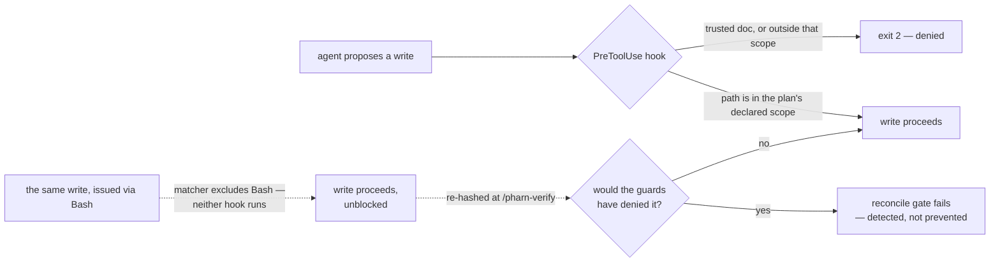
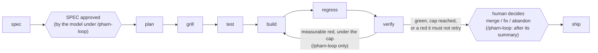

<div align="center">

<picture>
  <source media="(prefers-color-scheme: dark)" srcset="./docs/assets/pharn-logo-dark-transparent.svg" />
  <source media="(prefers-color-scheme: light)" srcset="./docs/assets/pharn-logo-light-transparent.svg" />
  
</picture>

**Audit-grade workflow for AI-assisted software development.**

PHARN turns an AI coding session into a persistent engineering record: the intent that anchored the
change, the plan the agent followed, the files it declared, the checks that ran, and the handoff at the
shipping gate.

It is open-source methodology, not a black box: Claude Code commands, readable Markdown artifacts,
deterministic hooks, stdlib-only floor checkers, grillers, and review lenses that live in your
repository. PHARN is strict about one thing: claims backed by deterministic checks are named as such;
model or human judgment remains advisory.

```bash
npx @pharn-dev/pharn@latest init
```

[](./CHANGELOG.md)
[](./LICENSE)
[](https://github.com/pharn-dev/pharn-oss/actions/workflows/ci.yml)
[](https://github.com/pharn-dev/pharn-oss/actions/workflows/codeql.yml)
[](https://github.com/pharn-dev/pharn-oss/actions/workflows/floor.yml)
[](https://github.com/pharn-dev/pharn-oss/actions/workflows/gitleaks.yml)
[](https://claude.com/claude-code)

</div>

> **Status:** Ready to install and use with Claude Code today. Active development continues;
> functionality that has not shipped yet is explicitly labeled.

---

## Contents

- [What PHARN is](#what-pharn-is)
- [Why it exists](#why-it-exists)
- [Quick start](#quick-start)
- [What gets installed](#what-gets-installed)
- [How the workflow works](#how-the-workflow-works)
- [Commands](#commands)
- [Capability coverage](#capability-coverage)
- [Why not just CLAUDE.md or AGENTS.md?](#why-not-just-claudemd-or-agentsmd)
- [Guaranteed vs advisory](#guaranteed-vs-advisory)
- [The pipeline](#the-pipeline)
- [PHARN builds PHARN](#pharn-builds-pharn)
- [Current limitations](#current-limitations)
- [Design docs](#design-docs)
- [Contributing](#contributing)
- [Security](#security)
- [License](#license)

---

## What PHARN is

PHARN is an open-source workflow layer for teams using AI agents to change real code. It gives each
increment a committed paper trail:

- `SPEC.md` — the human-readable intent PHARN asks you to approve before implementation (or, under the
  unattended `/pharn-loop`, approves for you and records as the model's approval).
- `PLAN.md` — the agent's implementation plan and declared write scope.
- `GRILL.md` — pre-build interrogation of the plan.
- `AC-TESTS.md`, `AC-TESTS.lock.json` — which test covers each acceptance criterion, and the pinned evidence
  that each of those tests failed before the build.
- `BUILD.md`, `REGRESSION.md`, `VERIFY.md`, `SHIP.md` — what changed, what ran, what passed, what did
  not, and where the run stopped.
- `cost.json`, `RUN-REPORT.md` — what the run cost and what it did, written by `/pharn-loop` at every
  stop and by `/pharn-ship` at every exit that ends a run. The first is machine-readable token counts
  per stage, iteration and model; the second is the human-readable view over it. Tokens only — PHARN
  ships no price table, so money is your own list price applied to those counts.

The project is intentionally small-surface: prompts and contracts in Markdown, plus deterministic Node
helpers. There is no hidden service in this repository and no proprietary rule engine needed to inspect
what PHARN is doing.

PHARN is **not** a correctness oracle, a security guarantee, or a replacement for tests and code review.
It preserves intent, narrows some agent write behavior, runs focused plan/code scrutiny, and labels the
boundary between deterministic checks and judgment.

---

## Why it exists

AI made code cheaper to produce. It did not make code cheaper to understand six weeks later.

The expensive questions moved upstream and downstream:

- What did we ask the agent to build?
- Which constraints shaped the plan?
- Which files was the agent supposed to edit?
- What did the workflow actually check?
- Which findings were deterministic, and which were model judgment?
- What should a reviewer, maintainer, or future incident responder trust?

PHARN puts those answers in the repo, where normal engineering tools can diff, review, and preserve
them. The goal is not to make AI development look clean. The goal is to make it inspectable.

---

## Quick start

PHARN runs on [Claude Code](https://claude.com/claude-code). The installer requires Node 20 or newer. In
your project root:

```bash
npx @pharn-dev/pharn@latest init
```

Then open Claude Code in the same project and run the full loop:

```text
/pharn-loop implement password reset with a one-time token
```

`/pharn-loop` runs spec → plan → grill → test → build → regress → verify **unattended**. The model approves its
own spec, writes each acceptance criterion's test and shows it fails before any code exists, repeats build →
regress → verify until a deterministic stop — green, the `--max-iter` cap, or a
result it must not retry — commits a green result to a new local branch (never pushed or merged), and
ends with a summary of what was done. When it reaches a point that needs a human decision, it stops and
says what it needs instead of guessing. On any stop other than a committed green result it reverts its
own spec approval — a procedural step, so an aborted run can skip it.

The test stage needs your project's test runner and its per-test results: a `test` script (and a `test:e2e` or
`e2e` script for end-to-end criteria) whose reporter writes JSON to the path PHARN passes
([Per-test results](#per-test-results)). Without them the run stops with `blocked: no-test-runner` and suggests a
setup increment to run first. The same split applies when a feature must change the runner itself: its config at
the project root, its test script, or its results format. PHARN pins those before the build, so plan that change as
its own setup increment first, run through `/pharn-ship`. `/pharn-plan` refuses a plan that names a root runner
config.

To approve the spec yourself and decide merge, fix, or abandon at the end, use the one-pass run with
both human gates:

```text
/pharn-ship implement password reset with a one-time token
```

Every stage is also available as its own command; see [Commands](#commands).

Already installed? `npx @pharn-dev/pharn status` reports your installed skills version and drift.
`update` re-fetches the latest skills version, `add` and `remove` manage capabilities, and `list` prints
what is installed. `init` installs into the project rather than onto your `PATH`, so keep the `npx`
prefix unless you installed the CLI globally.

**Two version numbers, on purpose.** The `pharn` badge above tracks
[`SKILLS_VERSION`](./SKILLS_VERSION) — the content an install receives, and what `status` and
`CHANGELOG.md` are keyed to. The npm package `@pharn-dev/pharn` carries the installer's own version.
They move independently and are not meant to match.

---

## What gets installed

The installer reads your project and selects the capabilities that apply before writing files. Detection
is JS/TS-shaped today: it reads `package.json` and scans for `next.config.*`, `app/` route handlers,
`.tsx`/`.jsx`, `migrations/`, and `.sql`, resolving to one or more of `ssr`, `backend`, `spa`, and `lib`
— a project can match several rather than exactly one. (The installer's own documentation gives Next plus
Express as an example resolving to `ssr` and `backend` together.) A repo with none of those signals still
installs the universal capabilities.

You see the selected capability list, with a reason beside each entry, before the installer writes. A
normal install adds:

- product commands in `.claude/commands/`,
- hooks in `.claude/hooks/`: the two write guards, the scope setter they read, and a `Stop` guard for
  `/pharn-loop` (see below),
- the four trusted docs — `pharn/CONSTITUTION.md` and `pharn/ARCHITECTURE.md`, plus `THREAT-MODEL.md` and
  `LIMITS.md` at the root,
- the deterministic floor, contracts, grillers, and review lenses under `pharn/`,
- `pharn.config.json`, pinning the skills version and exact installed commit, and carrying the
  `models.stages` block that sets each product command's model and effort (see
  [Current limitations](#current-limitations) for what that does and does not reach).

```text
your-repo/
├── .claude/
│   ├── commands/pharn-*.md        # the 11 product commands
│   ├── hooks/*.cjs                # the write guards, their setter, the /pharn-loop Stop guard
│   └── settings.json              # wires the hooks (see the caveat below)
├── pharn/
│   ├── CONSTITUTION.md            # trusted docs (human-only)
│   ├── ARCHITECTURE.md
│   ├── floor/*.mjs                # the deterministic checkers
│   ├── pharn-contracts/           # artifact shapes
│   ├── pharn-pipeline/grillers/   # plan interrogators
│   ├── pharn-review/              # code lenses
│   └── features/<name>/           # per increment, written as you run the pipeline — commit these:
│                                  # SPEC PLAN GRILL AC-TESTS (+ .lock.json) BUILD REGRESSION VERIFY, then SHIP + BRIEFING
│                                  # (/pharn-ship) or LOOP (/pharn-loop), and RUN-REPORT + cost.json
├── THREAT-MODEL.md                # the other two trusted docs
├── LIMITS.md
├── pharn.config.json              # skills version + installed commit + models.stages
└── .pharn/                        # runtime scratch — add to .gitignore
```

The hooks enforce only after they are registered in Claude Code's settings — `.claude/settings.json`, or
`.claude/settings.local.json`, which is loaded too and can wire or override the same hooks. If your
project already has a `.claude/settings.json`, the installer preserves it and warns instead of
overwriting it. Until you copy the hook wiring over, any guarantee that depends on a `PreToolUse` hook is
not active.

`require-loop-record.cjs` is not a write guard. It is a `Stop` hook: while an unattended `/pharn-loop` run
in the session has written no `LOOP.md`, it refuses to let the turn end, a bounded number of times per run,
and it fails open. It does nothing unless your settings register it under `Stop`. As of `6.12.0` the
`settings.json` PHARN ships registers it (matcher-less, exec form). An existing install whose
`settings.json` the installer preserved still needs that entry copied by hand — `pharn update` never
edits it.

Copy the wiring **as it ships**, anchored on the project-directory placeholder:

```json
"command": "node \"${CLAUDE_PROJECT_DIR}\"/.claude/hooks/protect-trusted-paths.cjs"
```

Claude Code runs a hook in Claude's _current_ directory, so a relative `node .claude/hooks/…` stops
starting after any `cd` into a subdirectory: node exits 1, which Claude Code treats as a non-blocking
error, and **both guards are then silently off**. That was the shipped form until `6.1.0`, and it is
measured, not theorised. Upgrading an older install is ordered: run `pharn update` first, then change
these two commands — the anchored wiring over pre-`6.1.0` hooks regresses both guards, so roll back in the
reverse order. Each guard judges the git working tree that contains Claude's current directory;
[`LIMITS.md` §7](./LIMITS.md) states the bounds that remain.

---

## How the workflow works

PHARN splits an AI-assisted change into typed stages:

1. **Spec** — turn prose intent into `SPEC.md`, surface gaps, and stop for approval.
2. **Plan** — turn the approved spec into `PLAN.md`, including the concrete files the build may touch.
3. **Grill** — interrogate the plan before code exists.
4. **Test** — write each acceptance criterion's test, run it, and require it to fail before any code exists.
5. **Build** — implement the plan. With the hooks wired as they ship, Claude Code write/edit tools are
   denied outside the active scope, in whichever working tree Claude is currently in.
6. **Regress** — re-run existing project suites and record breakage outside the feature.
7. **Verify** — run the project's gates, check declared artifacts and completeness signals (including missing
   concrete paths), and check that each acceptance criterion's locked test now passes.
8. **Ship** — write the ship/briefing artifacts and present the final human decision gate.

The approved spec body is pinned by a content hash, so later drift is detectable. Verification can also
report `INCOMPLETE` when a concrete path declared by the plan does not exist after the build.

Those are narrow checks, not magic. PHARN does not prove that the plan was wise, that every finding is
correct, or that the final code is secure. It makes the workflow legible and backs specific claims with
specific deterministic checks.

---

## Commands

Two commands cover the normal path. Every other command except `/pharn-review` and `/pharn-memory-promote` is
a pipeline stage those two run, available on its own when you want to inspect or drive one step manually. Those
two are standalone: neither is a pipeline stage, and neither is invoked by `/pharn-loop` or `/pharn-ship`.

| Command                 | Use it when you want to...                                                                                                                                                                                                                                 |
| ----------------------- | ---------------------------------------------------------------------------------------------------------------------------------------------------------------------------------------------------------------------------------------------------------- |
| `/pharn-loop`           | Run the full workflow unattended: the model approves the spec, iterates build → regress → verify to a deterministic stop, commits a green result to a local branch, and reports.                                                                           |
| `/pharn-ship`           | Run the full workflow once, then present the ship record and briefing at the final human decision gate.                                                                                                                                                    |
| `/pharn-review`         | Run code-review lenses in parallel over any code and merge their structured findings deterministically. This is standalone; it is not a pipeline stage.                                                                                                    |
| `/pharn-spec`           | Convert prose intent into a structured `SPEC.md`, surface gaps, and stop for approval before implementation.                                                                                                                                               |
| `/pharn-plan`           | Convert an approved `SPEC.md` into a `PLAN.md` with declared files and declared promoted lessons.                                                                                                                                                          |
| `/pharn-grill`          | Challenge the plan before code exists and re-check the spec/plan hash chain.                                                                                                                                                                               |
| `/pharn-test`           | Write each acceptance criterion's test before the build, into the files `/pharn-plan` mapped in `AC-TESTS.md`, run them and require each to fail, and pin the evidence. Runs between `/pharn-grill` and `/pharn-build` in `/pharn-ship` and `/pharn-loop`. |
| `/pharn-build`          | Implement the plan after setting the active write scope from `PLAN.md`.                                                                                                                                                                                    |
| `/pharn-regress`        | Re-run existing project suites and record regressions outside the feature.                                                                                                                                                                                 |
| `/pharn-verify`         | Check build artifacts and completeness signals, including declared concrete paths that were never created, and that every acceptance criterion's locked, once-red test passed.                                                                             |
| `/pharn-memory-promote` | Promote one lesson into `memory-bank/` through a gated provenance check.                                                                                                                                                                                   |

The command names are generated and drift-guarded in the [inventory below](#pharn-builds-pharn); the
one-line descriptions in this table are hand-written and are not.

---

## Capability coverage

Capabilities are named for the problem they inspect, not the framework they run in. Grillers interrogate
a **plan** before implementation; lenses read **code** after implementation or during standalone review.

**Grillers** — a11y, architecture, comprehension, coupling, documentation, error-handling, i18n,
migrations, observability, performance, privacy, security, testability.

**Lenses** — injection, SSRF, path traversal, insecure crypto, unsafe deserialization, secrets in code,
input validation, hallucinated APIs, missing `await`, missing timeouts, null dereference, off-by-one,
race conditions, resource leaks, swallowed exceptions, missing error handling, n-plus-one queries,
duplicated logic, copy-paste drift, magic values, placeholder-as-done, and a trust fence.

Every capability ships with eval cases and expected outputs. The floor refuses a capability whose
declared rules are not exercised by at least one eval.

This section is a tour, not the authoritative inventory. The drift-guarded lists are generated from the
repository: [`docs/capabilities/`](./docs/capabilities/README.md) and the
[current-state block](#pharn-builds-pharn) below.

---

## Why not just CLAUDE.md or AGENTS.md?

Keep them. PHARN is not a replacement for a project instructions file.

`CLAUDE.md`, `AGENTS.md`, and similar files are instructions the model may follow. PHARN adds versioned
workflow artifacts plus deterministic checks that do not depend on the model deciding that a sentence
should be obeyed.



- **A file states a rule. A hook can enforce one.** PHARN's `PreToolUse` hooks can deny writes through
  Claude Code's standard write/edit tools.
- **Approval becomes an explicit workflow gate.** A spec remains `Draft` until the user explicitly
  approves it. Downstream stages refuse a Draft or drifted spec.
- **Approved intent is pinned.** A content hash makes later edits to the approved spec body detectable.
- **Findings cite stable rule IDs.** A review finding names the rule it violates instead of relying on
  remembered chat context.
- **Guaranteed decisions avoid free-text judgment.** Deterministic gates operate on paths, hashes,
  enums, regex matches, exit codes, and other bounded values rather than asking the model whether
  something "looks safe."

PHARN still relies on agent orchestration to invoke parts of the workflow. It does not turn an LLM into
a trusted execution environment.

---

## Guaranteed vs advisory

This distinction is the core design rule.

A **guarantee** must reduce to a deterministic, non-LLM operation such as a hook decision, content-hash
comparison, enum/set-membership check, regex scan, or filesystem check. Anything that depends on model
judgment is **advisory**.

**Guaranteed** — examples of narrow claims backed by named checkers:

| Guarantee                                                                                                                                                                                                                                                                                                                                                                                                                                     | The check behind it                                                                                                                                                                                                                                  |
| --------------------------------------------------------------------------------------------------------------------------------------------------------------------------------------------------------------------------------------------------------------------------------------------------------------------------------------------------------------------------------------------------------------------------------------------- | ---------------------------------------------------------------------------------------------------------------------------------------------------------------------------------------------------------------------------------------------------- |
| The four trusted docs — and the guards' own control surface, and your project's own SPEC template (`pharn.spec-template.md`) — cannot be edited through Claude Code's Write/Edit/MultiEdit/NotebookEdit surface                                                                                                                                                                                                                               | `.claude/hooks/protect-trusted-paths.cjs`                                                                                                                                                                                                            |
| Memory-bank canon (`memory-bank/`, `.dev/memory-bank/`, subtrees included) is denied on that same surface, **unless** the active writes-scope was set by a promotion command **and** names that one canon file alone — so a build plan cannot grant itself a canon write                                                                                                                                                                      | `.claude/hooks/protect-trusted-paths.cjs` (origin read from `set-writes-scope.cjs`'s argv)                                                                                                                                                           |
| Writes through that same tool surface — **and only that surface**, since the wired `PreToolUse` matcher does not match `Bash` — are restricted to the active write scope, fail-closed to a default-safe set when none is active                                                                                                                                                                                                               | `set-writes-scope.cjs` + `enforce-writes-scope.cjs`                                                                                                                                                                                                  |
| The verify and regress verdicts are computed from a gate map the gate runner wrote, not one a model typed: each value is the exit code the runner recorded for the listed command, the keys cover the resolved gate set (plus `reconcile` for verify, which runs last), and no tree edit happened between consecutive gates                                                                                                                   | `run-gates.mjs`, validated by `check-verify.mjs --stamp` and `check-regress.mjs verdict --base-stamp … --head-stamp …`                                                                                                                               |
| A **non-adversarial** write that reached a path the active scope would have **denied** — including one issued through `Bash`, which no hook sees — is **detected** between build and verify, and fails the verify verdict. Detected, **not** prevented; git-ignored paths are outside the reconciled set; and a writer who also rewrites the baseline defeats it on ordinary paths                                                            | `reconcile-baseline.mjs --anchor` + `check-bash-reconcile.mjs`, feeding `check-verify.mjs`                                                                                                                                                           |
| An approved spec is pinned, so later body drift is detectable                                                                                                                                                                                                                                                                                                                                                                                 | `check-spec.mjs --hash` at approval; re-verified at plan, grill, test, build, regress, verify and ship by `check-spec-approved.mjs` (directly at plan, test and ship; through `check-plan-spec-agree.mjs` at grill, test, build, regress and verify) |
| A SPEC that declares `spec_template` has the template's sections, acceptance criteria each with an id, Given → When → Then and exactly one `verify:` level, and no clarification marker once approved. That the criteria are **phrased** testably — **not** that any test exists, runs, or passes; and opt-in, so a SPEC without the key is checked as before                                                                                 | `check-spec.mjs` (the rules in `pharn/pharn-contracts/spec-template.md`)                                                                                                                                                                             |
| A template — the shipped default or your own — is refused before `/pharn-spec` can pin it unless it has the required sections, a visible example criterion, the out-of-scope label and a `spec_template:` line; an existing but invalid project template stops the run instead of falling back to the default. A minimum shape — **not** that a SPEC filled from it will pass                                                                 | `check-spec.mjs --resolve-template-ref` (the refusals in `pharn/pharn-contracts/spec-template.md`)                                                                                                                                                   |
| Secret-shaped literals in a plan can be detected by the shipped regex scanner                                                                                                                                                                                                                                                                                                                                                                 | `scan-plan-secrets.mjs`                                                                                                                                                                                                                              |
| A missing concrete path declared by the plan yields an incomplete build signal                                                                                                                                                                                                                                                                                                                                                                | `check-build-complete.mjs` feeding `check-verify.mjs`                                                                                                                                                                                                |
| `/pharn-build` does not start until every acceptance criterion of a templated SPEC has a test, in the file the mapping names, that was collected and **failed** in a run bound to the pinned test files and the live tree (a `spec_kind: test-infra` SPEC gets a weaker bootstrap lock, labelled as such). That the record says **failed** — **not** why: a test failing on its own typo reads the same                                       | `check-test-stage.mjs`, over `check-ac-tests.mjs`, `check-red-run.mjs` and `ac-tests-lock.mjs`                                                                                                                                                       |
| `/pharn-verify` fails unless each acceptance criterion of a templated SPEC has a locked, once-red test titled `AC-<n>:`, in a file mapped to it, that **passed** on the head run — and fails too when those tests, the lock or the pinned test infrastructure changed after `/pharn-test`. That the reporter said **passed** — **not** that the test captures the criterion's intent, and the infrastructure pin covers a closed set of files | `check-verify.mjs --ac-gate` (`ac-gate-core.mjs`)                                                                                                                                                                                                    |
| Which lenses run, and how structured findings merge                                                                                                                                                                                                                                                                                                                                                                                           | `count-lenses.mjs` + `merge-findings.mjs`                                                                                                                                                                                                            |
| The eleven product commands' `model:` / `effort:` frontmatter equals what `pharn.config.json`'s `models.stages` resolves for that stage — not that the stage ran under it                                                                                                                                                                                                                                                                     | `check-model-config.mjs`                                                                                                                                                                                                                             |
| A run's `cost.json` is **internally consistent**: a closed top-level key set, every aggregate equal to a recompute from the recorded requests, unique request ids, a strictly increasing marker sequence, no absolute path anywhere, and every row inside the run window recomputed from its own recorded markers (so unrelated session activity cannot be summed in). Consistency only — **not** that the numbers describe the run           | `check-cost-ledger.mjs`                                                                                                                                                                                                                              |

**Advisory** — everything a model judges: whether a plan is wise, whether a review finding is real,
whether a severity is right, whether the code satisfies the product intent, and whether the resulting
system is well designed. These findings are surfaced for a human; they are not converted into guarantees
by wording them strongly.

**Important bounds:**

- The write guards cover Claude Code's Write/Edit/MultiEdit/NotebookEdit tool surface.
  **Writes performed through Bash bypass those hooks.**
- `scan-plan-secrets` detects configured patterns; it does not prove that a matched literal is a live
  secret or that an unmatched plan contains none.
- `check-build-complete` proves that declared concrete paths exist. It does not prove that the build
  modified them, or that their contents are correct.
- `check-cost-ledger` certifies that a `cost.json` agrees with itself. It does **not** bind the recorded
  requests to the session that produced them, so a self-consistent fabricated ledger passes — a test in
  the repository proves it by building one. The `--verify-transcript` flag re-derives the rows from the
  live transcript, but a transcript is machine-local and Claude Code prunes it on its own schedule, so
  that check is deliberately not a gate. The ledger annotates a run; it gates nothing.
- A validating gate-run stamp proves internal consistency, not provenance. A self-consistent fabricated
  stamp passes, and a test in the repository builds one to prove it. The stamp alone also says neither
  that the stage ran nor that the report on disk is its output. Under `/pharn-loop`, `check-loop-fresh.mjs`
  narrows that by binding each report to its stamp by hash and the verify stamp to the live tree. That is
  tree identity, not recency.
- `check-model-config` compares two files. Model and effort are applied by the Claude Code platform, so
  nothing here observes that a stage ran under the configured model — and an org `availableModels`
  allowlist or auto mode can decline a value silently.
- A green PHARN floor means the named deterministic checks passed. It does not mean the code is correct.

See [`LIMITS.md`](./LIMITS.md) for the full set of bounds.

---

## The pipeline

Eight typed stages, each emitting a typed artifact:



**What binds the chain is the SPEC→PLAN content-hash, not a field on every artifact and not a
stage-to-stage handoff.** Identity travels as the feature slug — `spec_id` ≡ `<name>` ≡ the feature
directory — and `check-plan-spec-agree.mjs` re-verifies the pin at **five** downstream stages (grill,
test, build, regress, verify). A literal `spec_id` field appears in `SPEC.md` (the root identity, read by
`check-spec.mjs --spec-id`), `PLAN.md` and `BRIEFING.md` — not on every artifact.

Stages do **not** each read the previous one's output. `/pharn-regress` reads the plan to derive the
inside/outside scope boundary; `/pharn-verify` reads the plan, its own gates and, for the acceptance-criteria
check, the SPEC's criteria, `AC-TESTS.md` and the lock, and it **does not read `regression-report.json` at all**. The stage that reads everything is `/pharn-ship`, which orchestrates
the chain and preserves two human decision points: explicit spec approval before planning, and the
final merge/fix/abandon decision after verification.

The orchestration itself is not a deterministic guarantee: the agent invokes the stages. The proceed/stop
decisions inside the pipeline are read from the deterministic verdicts emitted by the relevant checkers.

`/pharn-loop` runs the same chain without either human gate. The model approves the spec, and the build →
regress → verify middle repeats until a deterministic stop: green, the iteration cap, or a red it must not
retry (an inconclusive result; a reconcile red — a retry would re-anchor the baseline and erase the
detected escape; or, since 6.20.0, acceptance-criterion evidence that changed after `/pharn-test`, which another
build cannot restore — `blocked: ac-evidence-invalid`). Before it reads that stop, and again before it commits, `check-loop-fresh.mjs` checks that
the evidence belongs to the tree: each report must be its checker's output from a stamp that validates, bound
to it by hash, and the verify stamp must describe the live tree. A skipped or stale stage is re-run inside
the same iteration under a counted budget. A forged verdict or a spent budget ends the run as a recorded
blocked stop, not as a summary that names the skipped gates. That is tree identity, not recency: an iteration
whose build changed nothing can still reuse the previous iteration's evidence. Only a green result is
committed, to a new local branch, and only if its recorded decision re-derives from the reports it cites
(`check-loop-decision.mjs` re-runs the loop's stop computation and compares); a green that does not
re-derive is not committed. None of this proves the reports are honest: a self-consistent forged set of
stamps and reports still passes. Every other outcome reverts a
model-approved spec to `Draft`, or the run says it could not; a spec the run never approved (a stop on a
clarification marker, say) simply stays a `Draft`. The human decision comes after the run, on the branch or the
working tree it leaves.

**Standalone:** `/pharn-review` is not a pipeline stage. It runs review lenses in parallel as subagents
and merges their structured findings deterministically. You can run it against code independently of the
shipping pipeline.

### Your own SPEC template

`/pharn-spec` fills PHARN's default SPEC template unless your project has its own. To use your own, copy
`pharn/pharn-contracts/templates/spec-template.md` to `pharn.spec-template.md` at the project root and edit it
there: rename or reword sections, change the guidance comments, adjust the example. `/pharn-spec` then picks it
up on its next run, and every SPEC it writes records `project@sha256:…` as its template.

Edit that file yourself, outside Claude Code's write tools. This is by design: its guidance comments are
instructions `/pharn-spec` follows, so the path is fixed and the write guard denies Write/Edit to it, whether or
not the file exists. An existing install gets that protection when `pharn update` replaces the hook script. A
Bash write is not blocked (see [Current limitations](#current-limitations)), and neither is a change that
arrives by pull request or `git pull`: review edits to this file like code.

Before `/pharn-spec` fills a template it is checked. It needs the five required sections (Intent, Scope,
Acceptance Criteria, Constraints, Assumptions) as visible headings, one example criterion in the `- **AC-<n>**
Given … When … Then …` shape with one `verify:` line, the `**Out of scope…**` label under Scope, and a
`spec_template:` line in its frontmatter. It must also be a regular file named exactly `pharn.spec-template.md`,
not a symlink, and PHARN's own `pharn/` must not be reached through a symlink. If your template fails, `/pharn-spec` stops and names the reason; it does not fall back to the
default. Deleting the file later switches future SPECs back to the default, and it does not affect SPECs
already approved.

### Per-test results

A gate's exit code says whether the whole suite passed, not whether one named test ran: a suite exits 0 with
a skipped test. PHARN can also read a per-test record — each test's id, file, title and `passed`, `failed` or
`skipped` — from a JSON report your test runner writes. `/pharn-test` reads it, and since 6.20.0 so does
`/pharn-verify`'s acceptance-criteria check (both below).

To turn it on, name your reporter's format for each gate in `pharn.config.json`. The gates are `test` and the
e2e gates (`test:e2e`, `e2e`); the formats are `vitest-json` and `playwright-json`, both built into their
runner, so there is nothing to install:

```json
{ "testResults": { "test": "vitest-json", "test:e2e": "playwright-json" } }
```

An e2e gate exists only when your `package.json` has a `test:e2e` or `e2e` script. `/pharn-verify` runs it after
`build`, last among your project's gates; `/pharn-regress` never discovers it (a gate you name yourself with
`--gates` still runs). It gets the same per-gate time limit as every other gate (540 s), and
under `/pharn-loop` it runs on every iteration. Starting servers and installing browsers stay your script's job.

Then have the reporter write to the path PHARN passes in `PHARN_TEST_RESULTS`. PHARN sets that variable only
while its own stages run your gates, so an ordinary test run is unchanged. With vitest:

```js
// vitest.config.js
import { defineConfig } from "vitest/config";

const results = process.env.PHARN_TEST_RESULTS;
export default defineConfig({
  test: {
    // ...your other test options...
    ...(results ? { reporters: ["default", "json"], outputFile: { json: results } } : {}),
  },
});
```

With Playwright:

```js
// playwright.config.js
const { defineConfig } = require("@playwright/test");

const results = process.env.PHARN_TEST_RESULTS;
module.exports = defineConfig({
  // ...your other options...
  ...(results ? { reporter: [["list"], ["json", { outputFile: results }]] } : {}),
});
```

What the record can and cannot tell you is in `pharn/pharn-contracts/test-results-record.md`. In short, "passed"
means your reporter said so. A single flaky test or expected failure (`test.fail()`) voids the whole record rather
than being counted as a pass. `pharn.config.json` is not write-protected, so review changes to it like changes to your test script.

### Acceptance-criteria tests, before the build

For a SPEC filled from the template, `/pharn-plan` maps each acceptance criterion to a test file and the public
interface it drives (`AC-TESTS.md`), and `/pharn-test` writes those tests **before** `/pharn-build`, into files the
build is not allowed to write. Since 6.18.0 it also **runs** them and requires every criterion's test to **fail**:
a test that cannot fail, is never collected, or is skipped would otherwise pass unnoticed. The evidence — which
tests failed, bound to the files it pinned — goes into the committed `AC-TESTS.lock.json`. Since 6.19.0
`/pharn-ship` and `/pharn-loop` run it between `/pharn-grill` and `/pharn-build`, and `/pharn-build` refuses to start
until `check-test-stage.mjs` reads that evidence as complete. A feature planned or tested before 6.19.0 has to go
back through `/pharn-plan` and `/pharn-test` before it builds.

What it needs from your project:

- **A runner for each criterion's level, with per-test results.** `unit` and `integration` criteria run under your
  `test` script, `e2e` ones under `test:e2e` or `e2e`, and each of those gates needs its reporter configured as in
  [Per-test results](#per-test-results). Without them `/pharn-test` stops before writing anything and says which
  criterion has no runner. Set the runner up first, as its own increment: a SPEC with `spec_kind: test-infra` in its
  frontmatter gets a **bootstrap** lock instead — no tests before the build, which is weaker, and the lock says so.
- **Tests that import their target inside the test body.** Before the build the module under test does not exist.
  `await import("../src/reset.js")` inside the test makes that a failed test, which is what the red run wants; a
  top-level `import` makes the whole file fail to load, so none of its tests is collected, and the red run refuses
  that as the wrong reason. `/pharn-test` writes them this way. A runner that type-checks each file as it loads it
  (ts-jest with diagnostics on, for example) fails the file anyway; use its transpile-only mode.
- **An e2e runner that serves the app itself.** The red run does not run `build`; Playwright's `webServer` option
  is the usual way.

A criterion's test that already **passes** before the build is refused, with no override: either the test is
vacuous, or the behaviour exists and the criterion restates it. What the red run proves is limited to what the
record shows. "Failed" is the runner's status, so a test that fails on a typo of its own reads the same as one
that fails because the feature is missing. Details: `pharn/pharn-contracts/ac-tests.md`.

### What verify proves about acceptance criteria

Since 6.20.0 `/pharn-verify` checks each criterion, not only whole gates. **An AC is delivered = a locked, once-red
test titled `AC-n:`, in a file mapped to AC-n, passed on the head run. PHARN does not judge whether that test fully
captures the AC's intent.** The match is by file, so another feature's `AC-1:` in the same suite never counts. The
verify report carries a per-AC table (id, level, matched tests, status, reason), and `RUN-REPORT.md` shows it.

- **An AC not delivered yet** (its test is missing from the run, failed, or skipped) fails verify, and `/pharn-loop`
  builds again, like any failing gate.
- **AC evidence that changed** fails verify and stops `/pharn-loop` (`blocked: ac-evidence-invalid`): a pinned test
  or the lock was edited, the tests were never shown red, or the test infrastructure moved. Another build cannot fix
  that. `/pharn-test` now also pins what runs the tests: the level gates' `package.json` scripts (with their
  `pre`/`post` scripts), their `testResults` format, and root `vitest`/`vite`/`playwright`/`jest` config files. What
  it does not see — a setup file a config imports, environment-driven configuration, a chained script, `.npmrc`,
  `tsconfig`, the runner's version, and more — is listed in `pharn/pharn-contracts/ac-tests.md`. After the
  build, re-running `/pharn-test` means setting the build aside first, because its red run would now pass.
- **A feature locked before 6.20.0** has no infrastructure pin, and verify reports `test-infra-unpinned` until it goes
  back through `/pharn-test` that way.
- **A per-test record that cannot be read** makes verify inconclusive, never a pass. One flaky test, `test.fail()`,
  or duplicate test name anywhere in the suite voids the record.
- **A SPEC not filled from the template** is reported `not-applicable (legacy spec)` in the report, not silently
  passed. A `spec_kind: test-infra` SPEC gets **bootstrap** evidence: the level's gate ran and reported at least one
  passed test. That is weaker, and the report says so.

---

## PHARN builds PHARN

PHARN is built with its own workflow, one increment at a time, and the resulting development artifacts
are committed in this repository.

That means the repository contains real specs, plans, grill reports, reviews, regression reports, and
verification records produced while building PHARN itself. You can inspect the process instead of taking
the README's claims on trust.

The inventory below is **generated** from the live repository by `npm run docs:generate` and guarded
byte-for-byte by `npm run docs:check`, so it cannot quietly drift from what is actually built.

<!-- CURRENT-STATE:BEGIN — GENERATED by .dev/floor/gen-capability-catalog.mjs. DO NOT EDIT BETWEEN MARKERS. Regenerate: npm run docs:generate -->

- **Capabilities — 36 built**, counted by the `role:` frontmatter test (mirrors `pharn/floor/validate.mjs`): **13** grillers, **22** lenses, **1** skill (`pharn/pharn-core/seam-resolver/`), **0** validators, **0** verifiers, **0** auditors. Full list: [`docs/capabilities/README.md`](./docs/capabilities/README.md).
- **Contracts — 14** (`pharn/pharn-contracts/`): `ac-tests`, `cost-ledger`, `eval-format`, `finding-shape`, `gate-run-record`, `loop-record`, `reconciliation-record`, `regression-report`, `seam-config`, `ship-briefing`, `ship-record`, `spec-template`, `test-results-record`, `verify-report`.
- **Product commands — 11** (`.claude/commands/`): `/pharn-build`, `/pharn-grill`, `/pharn-loop`, `/pharn-memory-promote`, `/pharn-plan`, `/pharn-regress`, `/pharn-review`, `/pharn-ship`, `/pharn-spec`, `/pharn-test`, `/pharn-verify`.
- **Dev-apparatus commands — 9** (`.claude/commands/`): `/pharn-dev-build`, `/pharn-dev-eval`, `/pharn-dev-grill`, `/pharn-dev-memory-promote`, `/pharn-dev-plan`, `/pharn-dev-regress`, `/pharn-dev-review`, `/pharn-dev-ship`, `/pharn-dev-verify`.
- **Hook scripts — 4** (`.claude/hooks/`): `enforce-writes-scope.cjs`, `protect-trusted-paths.cjs`, `require-loop-record.cjs`, `set-writes-scope.cjs`.
- **Floor checkers — 79** `.mjs` files under `pharn/floor/` (tests excluded).

<!-- CURRENT-STATE:END -->

For concrete examples, browse [`.dev/features/`](./.dev/features/). The development history includes
cases where PHARN's own review workflow raised defects in PHARN changes before those increments were
finished — see [`.dev/features/span-redos-linear/REVIEW.md`](./.dev/features/span-redos-linear/REVIEW.md),
where the review caught a false bound shipped by the very increment that was repairing a false bound.

---

## Current limitations

PHARN is deliberately narrower than the claims many AI-development tools make.

- **Claude Code only today.** The current shipped integration uses Claude Code commands and hooks.
- **Shell writes are still not PREVENTED — they are now DETECTED, and that is a weaker thing.** The
  `PreToolUse` matcher wired in `.claude/settings.json` is `Write|Edit|MultiEdit|NotebookEdit`, and both
  hooks re-test that set in their own code, so a write issued through `Bash` never reaches either one and
  **is not blocked**. **Every write-guard guarantee on this page — the trusted-doc denylist, the canon
  denylist, and the writes-scope restriction — is scoped to that tool surface and to no other.** What
  changed is that such a write no longer goes unrecorded: `/pharn-build` anchors a content-hash baseline,
  and `/pharn-verify` runs `check-bash-reconcile.mjs`, which re-hashes the tree and asks the **live
  guards** whether each changed path would have been denied. Denied ⇒ the `reconcile` gate fails and the
  verify verdict is `FAIL`. **The claim is exactly "a write to a path the active scope would have denied
  is detected and fails the stage" — never "Bash writes are prevented."** Four bounds, all in
  [`reconciliation-record.md`](./pharn/pharn-contracts/reconciliation-record.md): git-ignored paths are
  outside the reconciled set; the window is anchor→verify; the model is one worktree per session; and
  there is no attribution — it reports _what_, never _who_. A clean verdict means **no escape was
  detected**, not that none occurred. **And this is accounting, not security.** The baseline is
  unauthenticated state inside the writable tree, so a writer who edits a denied file **and** rewrites
  that file's baseline entry gets a silent clean result. What it reliably catches is a **non-adversarial**
  escape — a formatter, a generator, a script, a mistake, which is the whole population of failures it
  was built for. **Deleting** its state is loud (a missing baseline is `INCONCLUSIVE` at verify) and the
  always-reconciled control surface (`.claude/hooks/*`, `.claude/settings*.json`, `pharn/floor/*`,
  `.dev/floor/*`) is anchored in committed blob ids rather than the baseline, so that half resists a
  determined writer — but **forging** an ordinary path's entry does not. Two further bounds, stated
  rather than solved: the checker runs from the worktree, so it cannot vouch for its own integrity; and
  the anchor is a shell step, so a run that skips it silently reuses an earlier epoch instead of failing.
  **The only true prevention remains OS-level sandboxing of the `Bash` process, which PHARN does not
  implement** — a harness-layer capability, not something markdown methodology can express, and the same
  category the missing authenticated baseline store falls into.
- **No shell command is ever parsed, and that is deliberate.** The reconciler compares hashes and paths;
  it never reads a `Bash` command string. Shell parsing is undecidable and a verb denylist would be a
  heuristic, which the constitution forbids labelling a guarantee — so `sed -i`, a here-doc, `node -e`, a
  Makefile target and a compiled binary are all equally visible to it, and none is special-cased.
- **The write-scope guard's fail-closed default does not cover your source.** Where
  `enforce-writes-scope.cjs` is wired and no scope is active, Claude Code's
  Write/Edit/MultiEdit/NotebookEdit tools may write only `pharn/features/**` in an installed project — PHARN's
  pipeline artifact directory. In PHARN's own dev repo (`.dev/floor/` present AND no `skillsVersion` in
  `pharn.config.json`), the default also admits `.dev/features/**` and `pharn/pharn-*/**`. **`.pharn/**` is
  writable too, but it is not part of that default** — it is the gitignored runtime-state directory the
  guard bootstraps from, composed into the allow-list unconditionally, so it stays writable **even under a
  set scope**. One path inside it is denied by name: `.pharn/writes-scope.json`, the guard's own input.
  The whole set is computed at runtime in `.claude/hooks/enforce-writes-scope.cjs`. Ordinary edits to your
  own code (`src/app.ts`, `package.json`, `README.md`) are denied. That is the intended posture — a stage
  sets the scope in its first step, so with the hooks wired as they ship, write/edit tool calls outside the
  concrete paths your `PLAN.md` declared are denied, in the working tree Claude is currently in — but it
  means the guard is not a drop-in for editing outside a PHARN run. Clearing the scope (`set-writes-scope.cjs --clear`, or deleting `.pharn/writes-scope.json`) returns
  to this default; it does **not** re-open your source. To write elsewhere, either set a scope that names
  those paths (`set-writes-scope.cjs --from-plan <PLAN.md>`) — noting that a set scope **replaces** this
  default rather than adding to it, so a scope naming `src/app.ts` also stops `pharn/features/**` from being
  writable — or leave `enforce-writes-scope.cjs` out of `.claude/settings.json`, at the cost of `writes:`
  enforcement.
- **The memory-bank denylist covers the write-tool surface only — Bash still reaches canon.**
  `THREAT-MODEL.md` treats memory-bank poisoning as the worst persistence vector. As of `3.1.1`
  `.claude/hooks/protect-trusted-paths.cjs` **does** deny `Write`/`Edit`/`MultiEdit`/`NotebookEdit` to
  `memory-bank/**` and `.dev/memory-bank/**`, and the escape is the writes-scope record's **origin**
  (`set_by`), which `set-writes-scope.cjs` writes from its own **argv** — so **no `writes:` declaration
  and no `PLAN.md` `## Files` entry can grant itself a canon write.** That closes the reported vector: a
  `## Files` entry naming `memory-bank/lessons-learned.md` is now denied rather than silently allowed.
  **What it does NOT close:** `PreToolUse` hooks never see **Bash**, so an agent holding Bash can still
  append to canon, run the setter with promote-shaped argv, or forge the scope record. No mechanism
  without that hole was found and none is claimed. So "canon cannot be written" stays **struck** — what
  changed is that on the guarded tool surface a canon write now costs a separate, explicit, auditable
  act that a build plan cannot cause. Keep reviewing `memory-bank/**` in diffs like any other file.
- **Model judgment remains model judgment.** Architecture quality, review correctness, severity,
  completeness of intent, and semantic correctness are advisory unless a specific deterministic checker
  covers the claim.
- **Approval is workflow discipline, not proof of a person.** A content hash detects drift after a spec is
  marked approved; it does not prove who marked it approved. Under `/pharn-loop` there is no person at
  all: the model approves and records `approved_by: model`, a marker nothing gates on.
- **Build completeness is filesystem-level.** PHARN can detect that a concrete declared path is missing;
  it cannot prove that an existing path was actually modified or implemented correctly.
- **Prompt injection is not solved.** PHARN narrows which data may influence guaranteed decisions, but it
  does not claim to eliminate prompt injection. That includes skills you install yourself: a
  `.claude/skills/<name>/SKILL.md` reaches product stages as untrusted context, and a hostile one can talk a
  lens out of reporting a real finding, which then never reaches you. That is only partly bounded;
  `THREAT-MODEL.md` §2 (item 8) and §5 state it in full.
- **No verifier/auditor capability ships yet.** `/pharn-verify` uses the shipped floor and project gates;
  the verifier plug-in slot remains empty.
- **Several announced modules are not built.** `pharn-audits`, `pharn-skills-*`, `pharn-stack-*`, and the
  rest of `pharn-core` — the constitution engine, the agnostic rule set, and the memory-bank commands
  beyond promotion. What exists is what the generated inventory above lists.
- **Per-stage model routing is static frontmatter, and it does not reach stages run inside an
  orchestrator.** `pharn.config.json`'s `models.stages` is the source of truth for the eleven product
  commands' `model:` / `effort:` frontmatter, and `pharn/floor/check-model-config.mjs` RED-fails when the
  two disagree — but a green checker means those two files agree, never that `/pharn-plan` ran on Opus,
  and nothing in PHARN observes what a stage actually ran under. Editing the config is therefore only
  half the change: update the command frontmatter too, or the checker will tell you. The full bounds —
  turn scope, the platform veto, and what deleting the block costs — are stated once, in
  [`LIMITS.md`](./LIMITS.md) § 8.
- **It is token-hungry by construction.** `/pharn-grill` runs the grillers over your plan and
  `/pharn-review` fans every applicable lens out as its own parallel subagent; `/pharn-loop` repeats
  build → regress → verify up to the cap, unattended — each pass re-runs your suite at the base and at
  HEAD plus every verify gate. That buys parallel scrutiny and costs tokens accordingly.
  Budget for it, or drive individual stages instead of the loop. Since `6.5.0` a run no longer leaves you
  guessing what it spent: `/pharn-loop` and `/pharn-ship` write `cost.json` and `RUN-REPORT.md` into the
  feature directory, with tokens broken down per stage, iteration and model. That is a measurement, not a
  reduction — it tells you the bill, it does not make the run cheaper.
- **Packaging is still pre-release shaped.** There are no GitHub releases or git tags yet; the installer
  currently fetches the repository's `main` and records the exact installed commit.

[`LIMITS.md`](./LIMITS.md) documents what PHARN does not guarantee.
[`THREAT-MODEL.md`](./THREAT-MODEL.md) documents the attack surface and trust assumptions.

---

## Design docs

The architecture is specified in four documents:

1. [`pharn/CONSTITUTION.md`](./pharn/CONSTITUTION.md) — the principles that govern commands, rules,
   guarantees, and PHARN's own development process.
2. [`pharn/ARCHITECTURE.md`](./pharn/ARCHITECTURE.md) — the floor, primitives, layer tree, and pipeline.
3. [`THREAT-MODEL.md`](./THREAT-MODEL.md) — the security foundation and attack surface.
4. [`LIMITS.md`](./LIMITS.md) — what PHARN does **not** guarantee.

These trusted docs are protected from edits through Claude Code's Write/Edit/MultiEdit/NotebookEdit tool
surface. Bash writes are outside that protection (see [Current limitations](#current-limitations)). All
four are copied into an install: the first two under `pharn/`, the other two at the project root.

---

## Contributing

PHARN is small-surface on purpose: a rule or enforcer is added in response to a real failure, not merely
because a hypothetical checker could exist.

See [`CONTRIBUTING.md`](./CONTRIBUTING.md) for the read-first order, required gates, and development loop.
Conduct expectations live in [`CODE_OF_CONDUCT.md`](./CODE_OF_CONDUCT.md); release history is in
[`CHANGELOG.md`](./CHANGELOG.md).

The floor and hooks carry **zero runtime dependencies** beyond the Node standard library; ESLint,
Prettier, and markdownlint are development-only.

## Security

Found a vulnerability? Please follow [`SECURITY.md`](./SECURITY.md) rather than opening a public issue.

## License

[Apache 2.0](./LICENSE).
