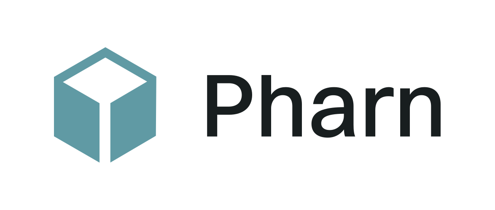
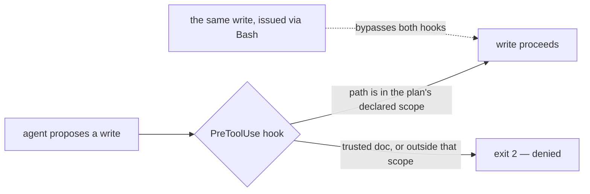
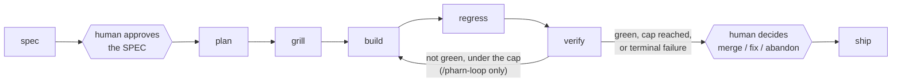

<div align="center">

<picture>
  <source media="(prefers-color-scheme: dark)" srcset="./docs/assets/pharn-logo-dark-transparent.svg" />
  <source media="(prefers-color-scheme: light)" srcset="./docs/assets/pharn-logo-light-transparent.svg" />
  
</picture>

**Audit-grade workflow for AI-assisted software development.**

PHARN turns an AI coding session into a persistent engineering record: the intent that anchored the
change, the plan the agent followed, the files it declared, the checks that ran, and the handoff at the
shipping gate.

It is open-source methodology, not a black box: Claude Code commands, readable Markdown artifacts,
deterministic hooks, stdlib-only floor checkers, grillers, and review lenses that live in your
repository. PHARN is strict about one thing: claims backed by deterministic checks are named as such;
model or human judgment remains advisory.

```bash
npx @pharn-dev/pharn@latest init
```

[](./CHANGELOG.md)
[](./LICENSE)
[](https://github.com/pharn-dev/pharn-oss/actions/workflows/ci.yml)
[](https://github.com/pharn-dev/pharn-oss/actions/workflows/codeql.yml)
[](https://github.com/pharn-dev/pharn-oss/actions/workflows/floor.yml)
[](https://github.com/pharn-dev/pharn-oss/actions/workflows/gitleaks.yml)
[](https://claude.com/claude-code)

</div>

> **Status:** Ready to install and use with Claude Code today. Active development continues;
> functionality that has not shipped yet is explicitly labeled.

---

## Contents

- [What PHARN is](#what-pharn-is)
- [Why it exists](#why-it-exists)
- [Quick start](#quick-start)
- [What gets installed](#what-gets-installed)
- [How the workflow works](#how-the-workflow-works)
- [Commands](#commands)
- [Capability coverage](#capability-coverage)
- [Why not just CLAUDE.md or AGENTS.md?](#why-not-just-claudemd-or-agentsmd)
- [Guaranteed vs advisory](#guaranteed-vs-advisory)
- [The pipeline](#the-pipeline)
- [PHARN builds PHARN](#pharn-builds-pharn)
- [Current limitations](#current-limitations)
- [Design docs](#design-docs)
- [Contributing](#contributing)
- [Security](#security)
- [License](#license)

---

## What PHARN is

PHARN is an open-source workflow layer for teams using AI agents to change real code. It gives each
increment a committed paper trail:

- `SPEC.md` — the human-readable intent PHARN asks you to approve before implementation.
- `PLAN.md` — the agent's implementation plan and declared write scope.
- `GRILL.md` — pre-build interrogation of the plan.
- `BUILD.md`, `REGRESSION.md`, `VERIFY.md`, `SHIP.md` — what changed, what ran, what passed, what did
  not, and where the run stopped.

The project is intentionally small-surface: prompts and contracts in Markdown, plus deterministic Node
helpers. There is no hidden service in this repository and no proprietary rule engine needed to inspect
what PHARN is doing.

PHARN is **not** a correctness oracle, a security guarantee, or a replacement for tests and code review.
It preserves intent, narrows some agent write behavior, runs focused plan/code scrutiny, and labels the
boundary between deterministic checks and judgment.

---

## Why it exists

AI made code cheaper to produce. It did not make code cheaper to understand six weeks later.

The expensive questions moved upstream and downstream:

- What did we ask the agent to build?
- Which constraints shaped the plan?
- Which files was the agent supposed to edit?
- What did the workflow actually check?
- Which findings were deterministic, and which were model judgment?
- What should a reviewer, maintainer, or future incident responder trust?

PHARN puts those answers in the repo, where normal engineering tools can diff, review, and preserve
them. The goal is not to make AI development look clean. The goal is to make it inspectable.

---

## Quick start

PHARN runs on [Claude Code](https://claude.com/claude-code). The installer requires Node 20 or newer; CI
runs it on Node 24. In your project root:

```bash
npx @pharn-dev/pharn@latest init
```

Then open Claude Code in the same project and run the full loop:

```text
/pharn-loop implement password reset with a one-time token
```

`/pharn-loop` runs spec → plan → grill → build → regress → verify, then repeats the build → regress →
verify middle until it reaches a deterministic stop condition: green, the `--max-iter` cap, or the first
terminal failure. It is designed around two human gates: approve the spec before code is written, then
decide merge, fix, or abandon after verification.

For a one-pass shipping run, use:

```text
/pharn-ship implement password reset with a one-time token
```

Every stage is also available as its own command; see [Commands](#commands).

Already installed? `npx @pharn-dev/pharn status` reports your installed skills version and drift.
`update` re-fetches the latest skills version, `add` and `remove` manage capabilities, and `list` prints
what is installed. `init` installs into the project rather than onto your `PATH`, so keep the `npx`
prefix unless you installed the CLI globally.

**Two version numbers, on purpose.** The `pharn` badge above tracks
[`SKILLS_VERSION`](./SKILLS_VERSION) — the content an install receives, and what `status` and
`CHANGELOG.md` are keyed to. The npm package `@pharn-dev/pharn` carries the installer's own version.
They move independently and are not meant to match.

---

## What gets installed

The installer reads your project and selects the capabilities that apply before writing files. Detection
is JS/TS-shaped today: it reads `package.json` and scans for `next.config.*`, `app/` route handlers,
`.tsx`/`.jsx`, `migrations/`, and `.sql`, resolving to `ssr`, `backend`, `spa`, or `lib`. A repo with none
of those signals still installs the universal capabilities.

You see the selected capability list, with a reason beside each entry, before the installer writes. A
normal install adds:

- product commands in `.claude/commands/`,
- write-gating hooks in `.claude/hooks/`,
- the deterministic floor, contracts, grillers, and review lenses under `pharn/`,
- `pharn.config.json`, pinning the skills version and exact installed commit.

```text
your-repo/
├── .claude/
│   ├── commands/pharn-*.md        # the 10 product commands
│   ├── hooks/*.cjs                # the write guards
│   └── settings.json              # wires the hooks (see the caveat below)
├── pharn/
│   ├── floor/*.mjs                # the deterministic checkers
│   ├── pharn-contracts/           # artifact shapes
│   ├── pharn-pipeline/grillers/   # plan interrogators
│   └── pharn-review/              # code lenses
├── pharn.config.json              # skills version + installed commit
├── features/<name>/               # per increment, written as you run the pipeline:
│                                  # SPEC PLAN GRILL BUILD REGRESSION VERIFY SHIP — commit these
└── .pharn/                        # runtime scratch — add to .gitignore
```

The hooks enforce only after they are registered in `.claude/settings.json`. If your project already has
that file, the installer preserves it and warns instead of overwriting it. Until you copy the hook wiring
over, any guarantee that depends on a `PreToolUse` hook is not active.

---

## How the workflow works

PHARN splits an AI-assisted change into typed stages:

1. **Spec** — turn prose intent into `SPEC.md`, surface gaps, and stop for approval.
2. **Plan** — turn the approved spec into `PLAN.md`, including the concrete files the build may touch.
3. **Grill** — interrogate the plan before code exists.
4. **Build** — implement the plan. With hooks wired, Claude Code write/edit tools are denied outside
   the active scope.
5. **Regress** — re-run existing project suites and record breakage outside the feature.
6. **Verify** — check declared artifacts and completeness signals, including missing concrete paths.
7. **Ship** — write the ship/briefing artifacts and present the final human decision gate.

The approved spec body is pinned by a content hash, so later drift is detectable. Verification can also
report `INCOMPLETE` when a concrete path declared by the plan does not exist after the build.

Those are narrow checks, not magic. PHARN does not prove that the plan was wise, that every finding is
correct, or that the final code is secure. It makes the workflow legible and backs specific claims with
specific deterministic checks.

---

## Commands

Two commands cover the normal path. The other eight are the stages those two run, available on their own
when you want to inspect or drive one step manually.

| Command                 | Use it when you want to...                                                                                                                              |
| ----------------------- | ------------------------------------------------------------------------------------------------------------------------------------------------------- |
| `/pharn-loop`           | Run the full workflow with bounded build → regress → verify iteration until green, the `--max-iter` cap, or a terminal failure.                         |
| `/pharn-ship`           | Run the full workflow once, then present the ship record and briefing at the final human decision gate.                                                 |
| `/pharn-review`         | Run code-review lenses in parallel over any code and merge their structured findings deterministically. This is standalone; it is not a pipeline stage. |
| `/pharn-spec`           | Convert prose intent into a structured `SPEC.md`, surface gaps, and stop for approval before implementation.                                            |
| `/pharn-plan`           | Convert an approved `SPEC.md` into a `PLAN.md` with declared files and declared promoted lessons.                                                       |
| `/pharn-grill`          | Challenge the plan before code exists and re-check the spec/plan hash chain.                                                                            |
| `/pharn-build`          | Implement the plan after setting the active write scope from `PLAN.md`.                                                                                 |
| `/pharn-regress`        | Re-run existing project suites and record regressions outside the feature.                                                                              |
| `/pharn-verify`         | Check build artifacts and completeness signals, including declared concrete paths that were never created.                                              |
| `/pharn-memory-promote` | Promote one lesson into `memory-bank/` through a gated provenance check.                                                                                |

The command names are generated and drift-guarded in the [inventory below](#pharn-builds-pharn); the
one-line descriptions in this table are hand-written and are not.

---

## Capability coverage

Capabilities are named for the problem they inspect, not the framework they run in. Grillers interrogate
a **plan** before implementation; lenses read **code** after implementation or during standalone review.

**Grillers** — a11y, architecture, comprehension, coupling, documentation, error-handling, i18n,
migrations, observability, performance, privacy, security, testability.

**Lenses** — injection, SSRF, path traversal, insecure crypto, unsafe deserialization, secrets in code,
input validation, hallucinated APIs, missing `await`, missing timeouts, null dereference, off-by-one,
race conditions, resource leaks, swallowed exceptions, missing error handling, n-plus-one queries,
duplicated logic, copy-paste drift, magic values, placeholder-as-done, and a trust fence.

Every capability ships with eval cases and expected outputs. The floor refuses a capability whose
declared rules are not exercised by at least one eval.

This section is a tour, not the authoritative inventory. The drift-guarded lists are generated from the
repository: [`docs/capabilities/`](./docs/capabilities/README.md) and the
[current-state block](#pharn-builds-pharn) below.

---

## Why not just CLAUDE.md or AGENTS.md?

Keep them. PHARN is not a replacement for a project instructions file.

`CLAUDE.md`, `AGENTS.md`, and similar files are instructions the model may follow. PHARN adds versioned
workflow artifacts plus deterministic checks that do not depend on the model deciding that a sentence
should be obeyed.



- **A file states a rule. A hook can enforce one.** PHARN's `PreToolUse` hooks can deny writes through
  Claude Code's standard write/edit tools.
- **Approval becomes an explicit workflow gate.** A spec remains `Draft` until the user explicitly
  approves it. Downstream stages refuse a Draft or drifted spec.
- **Approved intent is pinned.** A content hash makes later edits to the approved spec body detectable.
- **Findings cite stable rule IDs.** A review finding names the rule it violates instead of relying on
  remembered chat context.
- **Guaranteed decisions avoid free-text judgment.** Deterministic gates operate on paths, hashes,
  enums, regex matches, exit codes, and other bounded values rather than asking the model whether
  something "looks safe."

PHARN still relies on agent orchestration to invoke parts of the workflow. It does not turn an LLM into
a trusted execution environment.

---

## Guaranteed vs advisory

This distinction is the core design rule.

A **guarantee** must reduce to a deterministic, non-LLM operation such as a hook decision, content-hash
comparison, enum/set-membership check, regex scan, or filesystem check. Anything that depends on model
judgment is **advisory**.

**Guaranteed** — examples of narrow claims backed by named checkers:

| Guarantee                                                                                                                                      | The check behind it                                                                                                                                                                                        |
| ---------------------------------------------------------------------------------------------------------------------------------------------- | ---------------------------------------------------------------------------------------------------------------------------------------------------------------------------------------------------------- |
| The four trusted docs — and the guards' own control surface — cannot be edited through Claude Code's Write/Edit/MultiEdit/NotebookEdit surface | `.claude/hooks/protect-trusted-paths.cjs`                                                                                                                                                                  |
| That same tool surface is restricted to the active write scope, fail-closed to a default-safe set when none is active                          | `set-writes-scope.cjs` + `enforce-writes-scope.cjs`                                                                                                                                                        |
| An approved spec is pinned, so later body drift is detectable                                                                                  | `check-spec.mjs --hash` at approval; re-verified at plan, grill, build, regress, verify and ship by `check-spec-approved.mjs` (directly at plan and ship, through `check-plan-spec-agree.mjs` at the rest) |
| Secret-shaped literals in a plan can be detected by the shipped regex scanner                                                                  | `scan-plan-secrets.mjs`                                                                                                                                                                                    |
| A missing concrete path declared by the plan yields an incomplete build signal                                                                 | `check-build-complete.mjs` feeding `check-verify.mjs`                                                                                                                                                      |
| Which lenses run, and how structured findings merge                                                                                            | `count-lenses.mjs` + `merge-findings.mjs`                                                                                                                                                                  |

**Advisory** — everything a model judges: whether a plan is wise, whether a review finding is real,
whether a severity is right, whether the code satisfies the product intent, and whether the resulting
system is well designed. These findings are surfaced for a human; they are not converted into guarantees
by wording them strongly.

**Important bounds:**

- The write guards cover Claude Code's Write/Edit/MultiEdit/NotebookEdit tool surface.
  **Writes performed through Bash bypass those hooks.**
- `scan-plan-secrets` detects configured patterns; it does not prove that a matched literal is a live
  secret or that an unmatched plan contains none.
- `check-build-complete` proves that declared concrete paths exist. It does not prove that the build
  modified them, or that their contents are correct.
- A green PHARN floor means the named deterministic checks passed. It does not mean the code is correct.

See [`LIMITS.md`](./LIMITS.md) for the full set of bounds.

---

## The pipeline

Seven typed stages, each emitting a typed artifact:



**What binds the chain is the SPEC→PLAN content-hash, not a field on every artifact and not a
stage-to-stage handoff.** Identity travels as the feature slug — `spec_id` ≡ `<name>` ≡ the feature
directory — and `check-plan-spec-agree.mjs` re-verifies the pin at **four** downstream stages (grill,
build, regress, verify). A literal `spec_id` field appears in `SPEC.md` (the root identity, read by
`check-spec.mjs --spec-id`), `PLAN.md` and `BRIEFING.md` — not on every artifact.

Stages do **not** each read the previous one's output. `/pharn-regress` reads the plan to derive the
inside/outside scope boundary; `/pharn-verify` reads the plan and its own gates and **does not read
`regression-report.json` at all**. The stage that reads everything is `/pharn-ship`, which orchestrates
the chain and preserves two human decision points: explicit spec approval before planning, and the
final merge/fix/abandon decision after verification.

The orchestration itself is not a deterministic guarantee: the agent invokes the stages. The proceed/stop
decisions inside the pipeline are read from the deterministic verdicts emitted by the relevant checkers.

`/pharn-loop` iterates the build → regress → verify middle until a deterministic stop condition: green,
a bounded iteration cap, or a terminal failure.

**Standalone:** `/pharn-review` is not a pipeline stage. It runs review lenses in parallel as subagents
and merges their structured findings deterministically. You can run it against code independently of the
shipping pipeline.

---

## PHARN builds PHARN

PHARN is built with its own workflow, one increment at a time, and the resulting development artifacts
are committed in this repository.

That means the repository contains real specs, plans, grill reports, reviews, regression reports, and
verification records produced while building PHARN itself. You can inspect the process instead of taking
the README's claims on trust.

The inventory below is **generated** from the live repository by `npm run docs:generate` and guarded
byte-for-byte by `npm run docs:check`, so it cannot quietly drift from what is actually built.

<!-- CURRENT-STATE:BEGIN — GENERATED by .dev/floor/gen-capability-catalog.mjs. DO NOT EDIT BETWEEN MARKERS. Regenerate: npm run docs:generate -->

- **Capabilities — 36 built**, counted by the `role:` frontmatter test (mirrors `pharn/floor/validate.mjs`): **13** grillers, **22** lenses, **1** skill (`pharn/pharn-core/seam-resolver/`), **0** validators, **0** verifiers, **0** auditors. Full list: [`docs/capabilities/README.md`](./docs/capabilities/README.md).
- **Contracts — 6** (`pharn/pharn-contracts/`): `eval-format`, `finding-shape`, `loop-record`, `seam-config`, `ship-briefing`, `ship-record`.
- **Product commands — 10** (`.claude/commands/`): `/pharn-build`, `/pharn-grill`, `/pharn-loop`, `/pharn-memory-promote`, `/pharn-plan`, `/pharn-regress`, `/pharn-review`, `/pharn-ship`, `/pharn-spec`, `/pharn-verify`.
- **Dev-apparatus commands — 9** (`.claude/commands/`): `/pharn-dev-build`, `/pharn-dev-eval`, `/pharn-dev-grill`, `/pharn-dev-memory-promote`, `/pharn-dev-plan`, `/pharn-dev-regress`, `/pharn-dev-review`, `/pharn-dev-ship`, `/pharn-dev-verify`.
- **Hook scripts — 3** (`.claude/hooks/`): `enforce-writes-scope.cjs`, `protect-trusted-paths.cjs`, `set-writes-scope.cjs`.
- **Floor checkers — 50** `.mjs` files under `pharn/floor/` (tests excluded).

<!-- CURRENT-STATE:END -->

For concrete examples, browse [`.dev/features/`](./.dev/features/). The development history includes
cases where PHARN's own review workflow raised defects in PHARN changes before those increments were
finished — see [`.dev/features/span-redos-linear/REVIEW.md`](./.dev/features/span-redos-linear/REVIEW.md),
where the review caught a false bound shipped by the very increment that was repairing a false bound.

---

## Current limitations

PHARN is deliberately narrower than the claims many AI-development tools make.

- **Claude Code only today.** The current shipped integration uses Claude Code commands and hooks.
- **Shell writes are outside the write guard.** Bash can modify files without passing through the
  `PreToolUse` write-scope hooks.
- **The write-scope guard's fail-closed default does not cover your source.** Where
  `enforce-writes-scope.cjs` is wired and no scope is active, Claude Code's
  Write/Edit/MultiEdit/NotebookEdit tools are restricted to `features/**` and `.pharn/**` in an
  installed project — PHARN's product pipeline artifact directories. In PHARN's own dev repo (`.dev/floor/`
  present AND no `skillsVersion` in `pharn.config.json`), the default also admits `.dev/features/**` and
  `pharn/pharn-*/**`. The
  set is computed at runtime in `.claude/hooks/enforce-writes-scope.cjs`.
  Ordinary edits to your own code (`src/app.ts`, `package.json`, `README.md`) are denied. That is the
  intended posture — a stage sets the scope in its first step, so with hooks wired, write/edit tool calls
  outside the concrete paths your `PLAN.md` declared are denied — but it means the guard is not a drop-in
  for editing outside a PHARN run. Clearing the scope (`set-writes-scope.cjs --clear`, or deleting
  `.pharn/writes-scope.json`) returns to this default; it does **not** re-open your source. To write
  elsewhere, either set a scope that names those paths
  (`set-writes-scope.cjs --from-plan <PLAN.md>`), or leave `enforce-writes-scope.cjs` out of
  `.claude/settings.json` — at the cost of `writes:` enforcement.
- **Model judgment remains model judgment.** Architecture quality, review correctness, severity,
  completeness of intent, and semantic correctness are advisory unless a specific deterministic checker
  covers the claim.
- **Approval is workflow discipline, not proof of a person.** A content hash detects drift after a spec is
  marked approved; it does not prove who marked it approved.
- **Build completeness is filesystem-level.** PHARN can detect that a concrete declared path is missing;
  it cannot prove that an existing path was actually modified or implemented correctly.
- **Prompt injection is not solved.** PHARN narrows which data may influence guaranteed decisions, but it
  does not claim to eliminate prompt injection.
- **No verifier/auditor capability ships yet.** `/pharn-verify` uses the shipped floor and project gates;
  the verifier plug-in slot remains empty.
- **Several announced modules are not built.** `pharn-audits`, `pharn-skills-*`, `pharn-stack-*`, and the
  rest of `pharn-core` — the constitution engine, the agnostic rule set, and the memory-bank commands
  beyond promotion. What exists is what the generated inventory above lists.
- **Per-stage model routing is not wired yet.** `pharn.config.json` carries a `models` block, and the
  installer validates it and prints it back, but no product command reads it — the pipeline runs on
  whatever model your Claude Code session is using. Treat the block as reserved, not as a control.
- **It is token-hungry by construction.** `/pharn-grill` runs the grillers over your plan and
  `/pharn-review` fans every applicable lens out as its own parallel subagent; `/pharn-loop` repeats
  build → regress → verify up to the cap. That buys parallel scrutiny and costs tokens accordingly.
  Budget for it, or drive individual stages instead of the loop.
- **Packaging is still pre-release shaped.** There are no GitHub releases or git tags yet; the installer
  currently fetches the repository's `main` and records the exact installed commit.
- **Not every design doc ships into an install.** The installer copies `pharn/CONSTITUTION.md` and
  `pharn/ARCHITECTURE.md` only; `THREAT-MODEL.md` and `LIMITS.md` are read here, in the repository.

[`LIMITS.md`](./LIMITS.md) documents what PHARN does not guarantee.
[`THREAT-MODEL.md`](./THREAT-MODEL.md) documents the attack surface and trust assumptions.

---

## Design docs

The architecture is specified in four documents:

1. [`pharn/CONSTITUTION.md`](./pharn/CONSTITUTION.md) — the principles that govern commands, rules,
   guarantees, and PHARN's own development process.
2. [`pharn/ARCHITECTURE.md`](./pharn/ARCHITECTURE.md) — the floor, primitives, layer tree, and pipeline.
3. [`THREAT-MODEL.md`](./THREAT-MODEL.md) — the security foundation and attack surface.
4. [`LIMITS.md`](./LIMITS.md) — what PHARN does **not** guarantee.

These trusted docs are protected from edits through Claude Code's Write/Edit/MultiEdit/NotebookEdit tool
surface. As described above, Bash writes are outside that protection, and only the first two are copied
into an install (see [Current limitations](#current-limitations)).

---

## Contributing

PHARN is small-surface on purpose: a rule or enforcer is added in response to a real failure, not merely
because a hypothetical checker could exist.

See [`CONTRIBUTING.md`](./CONTRIBUTING.md) for the read-first order, required gates, and development loop.
Conduct expectations live in [`CODE_OF_CONDUCT.md`](./CODE_OF_CONDUCT.md); release history is in
[`CHANGELOG.md`](./CHANGELOG.md).

The floor and hooks carry **zero runtime dependencies** beyond the Node standard library; ESLint,
Prettier, and markdownlint are development-only.

## Security

Found a vulnerability? Please follow [`SECURITY.md`](./SECURITY.md) rather than opening a public issue.

## License

[Apache 2.0](./LICENSE).
