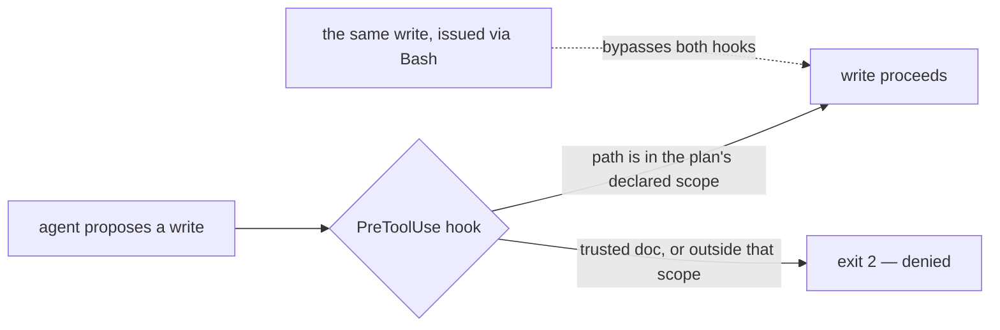
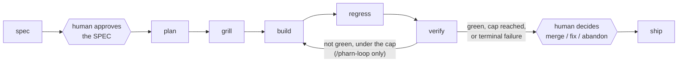

<div align="center">

# PHARN

**Code got cheap. Understanding got scarce.**

PHARN gives AI-assisted development a persistent engineering record: what you intended to build,
how the agent planned it, what changed, and what was checked before shipping.

Specs, plans, review artifacts, and rules stay in your repository as readable Markdown. Deterministic
hooks and checkers enforce the parts that can actually be enforced; everything that still depends on
model judgment is treated as advisory.

```bash
npx @pharn-dev/pharn@latest init
```

[](./CHANGELOG.md)
[](./LICENSE)
[](https://github.com/pharn-dev/pharn-oss/actions/workflows/ci.yml)
[](https://github.com/pharn-dev/pharn-oss/actions/workflows/codeql.yml)
[](https://github.com/pharn-dev/pharn-oss/actions/workflows/floor.yml)
[](https://github.com/pharn-dev/pharn-oss/actions/workflows/gitleaks.yml)
[](https://claude.com/claude-code)

</div>

> **Status:** Ready to install and use with Claude Code today. Active development continues;
> functionality that has not shipped yet is explicitly labeled.

---

## Contents

- [What PHARN does](#what-pharn-does)
- [Quick start](#quick-start)
- [Commands](#commands)
- [What it catches](#what-it-catches)
- [Why not just CLAUDE.md or AGENTS.md?](#why-not-just-claudemd-or-agentsmd)
- [Guaranteed vs advisory](#guaranteed-vs-advisory)
- [The pipeline](#the-pipeline)
- [PHARN builds PHARN](#pharn-builds-pharn)
- [Current limitations](#current-limitations)
- [Design docs](#design-docs)
- [Contributing](#contributing)
- [Security](#security)
- [License](#license)

---

## What PHARN does

AI agents can write code quickly, but the reasoning behind a change usually disappears with the chat:
why the change exists, what constraints mattered, what the agent planned, and what was actually checked.

PHARN keeps that reasoning in the repository as versioned artifacts and adds deterministic checks around
the parts of the workflow that can be checked without trusting the model.

**Before code is written** — you describe the intent. PHARN turns it into a structured `SPEC.md`,
interrogates it for gaps, and stops for explicit human approval. An approved spec is pinned by a SHA-256
hash of its body, so later intent drift is detectable.

**While the agent works** — the plan declares the files it expects to touch. Claude Code's
Write/Edit/MultiEdit/NotebookEdit tools are restricted to the active write scope by deterministic hooks.
Grillers interrogate the plan before implementation, while review lenses inspect code for classes of
problems such as injection, SSRF, path traversal, n-plus-one queries, swallowed exceptions, race
conditions, and placeholder code shipped as done.

**After the change** — PHARN leaves a diffable trail: the spec, plan, grill log, regression report, and
verify report. Verification also checks build completeness at the filesystem level: if a concrete path
declared by the plan does not exist after the build, verification reports `INCOMPLETE`.

PHARN does **not** prove that a plan is good, that a finding is correct, or that the resulting code is
correct or secure. Those remain model or human judgments. The point is to preserve the reasoning and
make deterministic claims only where PHARN can actually support them.

---

## Quick start

PHARN runs on [Claude Code](https://claude.com/claude-code). The installer requires Node 20 or newer; CI
runs it on Node 24. In your project root:

```bash
npx @pharn-dev/pharn@latest init
```

Archetype detection is JS/TS-shaped: it reads `package.json` and scans for `next.config.*`, `app/`
route handlers, `.tsx`/`.jsx`, `migrations/` and `.sql`, resolving to `ssr`, `backend`, `spa`, or `lib`.
A repo with none of those still installs and gets the universal capabilities — 28 of the 35 grillers and
lenses declare `applies: ["universal"]` and read code without assuming a language. The seven that do not
are the SSR/SPA/backend-specific ones.

The installer reads those signals, detects your project's archetype, and selects the capabilities
that apply — showing you the full list, with a reason beside each one, before it writes anything. It
then installs:

- the **product commands** into `.claude/commands/`,
- the **write-gating hooks** into `.claude/hooks/`,
- the **floor** — the deterministic checkers — plus the **contracts**, **grillers** and **review lenses**
  under `pharn/`,
- and a `pharn.config.json` pinning the skills version and the exact commit it installed from.

Concretely, that is:

```text
your-repo/
├── .claude/
│   ├── commands/pharn-*.md        # the 10 product commands
│   ├── hooks/*.cjs                # the write guards
│   └── settings.json              # wires the hooks (see the caveat below)
├── pharn/
│   ├── floor/*.mjs                # the deterministic checkers
│   ├── pharn-contracts/           # artifact shapes
│   ├── pharn-pipeline/grillers/   # plan interrogators
│   └── pharn-review/              # code lenses
├── pharn.config.json              # skills version + installed commit
├── features/<name>/               # per increment, written as you run the pipeline:
│                                  # SPEC PLAN GRILL BUILD REGRESSION VERIFY SHIP — commit these
└── .pharn/                        # runtime scratch — add to .gitignore
```

The hooks only enforce anything once they are registered in `.claude/settings.json`. If your project
already has that file, the installer **preserves it and does not wire the hooks** — it warns, and the
wiring is then yours to copy over. Until you do, everything in
[Guaranteed vs advisory](#guaranteed-vs-advisory) that depends on a `PreToolUse` hook is not in force.

Then open Claude Code and describe what you want built:

```text
/pharn-loop implement password reset with a one-time token
```

`/pharn-loop` runs the whole chain — spec, plan, grill, build, regress, verify — and iterates the
build → regress → verify middle until a deterministic stop: floor-green, the iteration cap
(`--max-iter N`, default 3), or the first terminal failure. It hands back to you at exactly two points, and no others: once to approve the
`SPEC.md` before any code is written, and once after verification to decide merge, fix, or abandon.

`/pharn-ship` is the same chain without the auto-iteration — one pass, then the PR. Every stage is also
its own command if you want to stop somewhere and look; see [Commands](#commands).

Already installed? `npx @pharn-dev/pharn status` reports your version and whether any installed file has
drifted; `update` re-fetches at the latest skills version; `add` and `remove` manage individual
capabilities; `list` prints what is installed. (`init` installs into the project, not onto your `PATH`,
so keep the `npx` prefix unless you installed the CLI globally.)

**Two version numbers, on purpose.** The `pharn` badge above tracks
[`SKILLS_VERSION`](./SKILLS_VERSION) — the content an install receives, and what `status` and
`CHANGELOG.md` are keyed to. The npm package `@pharn-dev/pharn` carries the installer's own version.
They move independently and are not meant to match.

---

## Commands

Two commands cover the normal case. The other eight are the stages those two run, available on their own
when you want to drive a step yourself.

| Command                 | What it does                                                                                                                                                     |
| ----------------------- | ---------------------------------------------------------------------------------------------------------------------------------------------------------------- |
| `/pharn-loop`           | The whole chain, auto-iterated until a deterministic stop (green, the `--max-iter` cap, default 3, or the first terminal failure). Two human gates, no `--yolo`. |
| `/pharn-ship`           | The same chain, one pass, then the PR — gated on the same two human decisions.                                                                                   |
| `/pharn-review`         | Review lenses over any code, run in parallel as subagents, findings merged deterministically. Not a pipeline stage: point it at anything, any time.              |
| `/pharn-spec`           | Prose intent into a structured `SPEC.md`, gaps surfaced, stops for your approval, pinned by a body hash once approved.                                           |
| `/pharn-plan`           | An approved `SPEC.md` into a `PLAN.md` — the files the build may touch, and which of your promoted lessons the plan declares it applied.                         |
| `/pharn-grill`          | Grillers interrogate the plan before code exists; the spec to plan hash chain and the plan's declared lessons are both re-verified.                              |
| `/pharn-build`          | Writes the implementation, scoped to the paths the plan declared.                                                                                                |
| `/pharn-regress`        | Re-runs your existing suites to catch breakage outside the feature just built.                                                                                   |
| `/pharn-verify`         | Checks the build against the plan's contracts; a declared file that was never written yields `INCOMPLETE`.                                                       |
| `/pharn-memory-promote` | Gated promotion of a single lesson into your `memory-bank/`.                                                                                                     |

The command names are generated and drift-guarded in the [inventory below](#pharn-builds-pharn); the
one-line descriptions in this table are hand-written and are not.

---

## What it catches

Capabilities are named for the problem they find, not the technology they use. Grillers interrogate a
**plan**; lenses read **code**.

**Grillers** — a11y, architecture, comprehension, coupling, documentation, error-handling, i18n,
migrations, observability, performance, privacy, security, testability.

**Lenses** — injection, SSRF, path traversal, insecure crypto, unsafe deserialization, secrets in code,
input validation, hallucinated APIs, missing `await`, missing timeouts, null dereference, off-by-one,
race conditions, resource leaks, swallowed exceptions, missing error handling, n-plus-one queries,
duplicated logic, copy-paste drift, magic values, placeholder-as-done, and a trust fence.

Every capability ships with its own eval cases and expected outputs; the floor refuses a capability
whose rules no eval exercises.

This section is a tour, not the authoritative inventory. The drift-guarded lists are generated from the
repository: [`docs/capabilities/`](./docs/capabilities/README.md) and the
[current-state block](#pharn-builds-pharn) below.

---

## Why not just CLAUDE.md or AGENTS.md?

Keep them. PHARN is not a replacement for a project instructions file.

`CLAUDE.md`, `AGENTS.md`, and similar files are instructions the model may follow. PHARN adds versioned
workflow artifacts plus deterministic checks that do not depend on the model deciding that a sentence
should be obeyed.



- **A file states a rule. A hook can enforce one.** PHARN's `PreToolUse` hooks can deny writes through
  Claude Code's standard write/edit tools.
- **Approval becomes an explicit workflow gate.** A spec remains `Draft` until the user explicitly
  approves it. Downstream stages refuse a Draft or drifted spec.
- **Approved intent is pinned.** A content hash makes later edits to the approved spec body detectable.
- **Findings cite stable rule IDs.** A review finding names the rule it violates instead of relying on
  remembered chat context.
- **Guaranteed decisions avoid free-text judgment.** Deterministic gates operate on paths, hashes,
  enums, regex matches, exit codes, and other bounded values rather than asking the model whether
  something "looks safe."

PHARN still relies on agent orchestration to invoke parts of the workflow. It does not turn an LLM into
a trusted execution environment.

---

## Guaranteed vs advisory

This distinction is the core design rule.

A **guarantee** must reduce to a deterministic, non-LLM operation such as a hook decision, content-hash
comparison, enum/set-membership check, regex scan, or filesystem check. Anything that depends on model
judgment is **advisory**.

**Guaranteed** — examples of narrow claims backed by named checkers:

| Guarantee                                                                                                                                      | The check behind it                                                                                                                                                                                        |
| ---------------------------------------------------------------------------------------------------------------------------------------------- | ---------------------------------------------------------------------------------------------------------------------------------------------------------------------------------------------------------- |
| The four trusted docs — and the guards' own control surface — cannot be edited through Claude Code's Write/Edit/MultiEdit/NotebookEdit surface | `.claude/hooks/protect-trusted-paths.cjs`                                                                                                                                                                  |
| That same tool surface is restricted to the active write scope, fail-closed to a default-safe set when none is active                          | `set-writes-scope.cjs` + `enforce-writes-scope.cjs`                                                                                                                                                        |
| An approved spec is pinned, so later body drift is detectable                                                                                  | `check-spec.mjs --hash` at approval; re-verified at plan, grill, build, regress, verify and ship by `check-spec-approved.mjs` (directly at plan and ship, through `check-plan-spec-agree.mjs` at the rest) |
| Secret-shaped literals in a plan can be detected by the shipped regex scanner                                                                  | `scan-plan-secrets.mjs`                                                                                                                                                                                    |
| A missing concrete path declared by the plan yields an incomplete build signal                                                                 | `check-build-complete.mjs` feeding `check-verify.mjs`                                                                                                                                                      |
| Which lenses run, and how structured findings merge                                                                                            | `count-lenses.mjs` + `merge-findings.mjs`                                                                                                                                                                  |

**Advisory** — everything a model judges: whether a plan is wise, whether a review finding is real,
whether a severity is right, whether the code satisfies the product intent, and whether the resulting
system is well designed. These findings are surfaced for a human; they are not converted into guarantees
by wording them strongly.

**Important bounds:**

- The write guards cover Claude Code's Write/Edit/MultiEdit/NotebookEdit tool surface.
  **Writes performed through Bash bypass those hooks.**
- `scan-plan-secrets` detects configured patterns; it does not prove that a matched literal is a live
  secret or that an unmatched plan contains none.
- `check-build-complete` proves that declared concrete paths exist. It does not prove that the build
  modified them, or that their contents are correct.
- A green PHARN floor means the named deterministic checks passed. It does not mean the code is correct.

See [`LIMITS.md`](./LIMITS.md) for the full set of bounds.

---

## The pipeline

Seven typed stages. Each emits a versioned artifact carrying the `spec_id`, and each reads what the
previous stage produced:



`/pharn-ship` orchestrates that chain and preserves two human decision points: explicit spec approval
before planning, and the final merge/fix/abandon decision after verification.

The orchestration itself is not a deterministic guarantee: the agent invokes the stages. The proceed/stop
decisions inside the pipeline are read from the deterministic verdicts emitted by the relevant checkers.

`/pharn-loop` iterates the build → regress → verify middle until a deterministic stop condition: green,
a bounded iteration cap, or a terminal failure.

**Standalone:** `/pharn-review` is not a pipeline stage. It runs review lenses in parallel as subagents
and merges their structured findings deterministically. You can run it against code independently of the
shipping pipeline.

---

## PHARN builds PHARN

PHARN is built with its own workflow, one increment at a time, and the resulting development artifacts
are committed in this repository.

That means the repository contains real specs, plans, grill reports, reviews, regression reports, and
verification records produced while building PHARN itself. You can inspect the process instead of taking
the README's claims on trust.

The inventory below is **generated** from the live repository by `npm run docs:generate` and guarded
byte-for-byte by `npm run docs:check`, so it cannot quietly drift from what is actually built.

<!-- CURRENT-STATE:BEGIN — GENERATED by .dev/floor/gen-capability-catalog.mjs. DO NOT EDIT BETWEEN MARKERS. Regenerate: npm run docs:generate -->

- **Capabilities — 36 built**, counted by the `role:` frontmatter test (mirrors `pharn/floor/validate.mjs`): **13** grillers, **22** lenses, **1** skill (`pharn/pharn-core/seam-resolver/`), **0** validators, **0** verifiers, **0** auditors. Full list: [`docs/capabilities/README.md`](./docs/capabilities/README.md).
- **Contracts — 6** (`pharn/pharn-contracts/`): `eval-format`, `finding-shape`, `loop-record`, `seam-config`, `ship-briefing`, `ship-record`.
- **Product commands — 10** (`.claude/commands/`): `/pharn-build`, `/pharn-grill`, `/pharn-loop`, `/pharn-memory-promote`, `/pharn-plan`, `/pharn-regress`, `/pharn-review`, `/pharn-ship`, `/pharn-spec`, `/pharn-verify`.
- **Dev-apparatus commands — 9** (`.claude/commands/`): `/pharn-dev-build`, `/pharn-dev-eval`, `/pharn-dev-grill`, `/pharn-dev-memory-promote`, `/pharn-dev-plan`, `/pharn-dev-regress`, `/pharn-dev-review`, `/pharn-dev-ship`, `/pharn-dev-verify`.
- **Hook scripts — 3** (`.claude/hooks/`): `enforce-writes-scope.cjs`, `protect-trusted-paths.cjs`, `set-writes-scope.cjs`.
- **Floor checkers — 50** `.mjs` files under `pharn/floor/` (tests excluded).

<!-- CURRENT-STATE:END -->

For concrete examples, browse [`.dev/features/`](./.dev/features/). The development history includes
cases where PHARN's own review workflow raised defects in PHARN changes before those increments were
finished — see [`.dev/features/span-redos-linear/REVIEW.md`](./.dev/features/span-redos-linear/REVIEW.md),
where the review caught a false bound shipped by the very increment that was repairing a false bound.

---

## Current limitations

PHARN is deliberately narrower than the claims many AI-development tools make.

- **Claude Code only today.** The current shipped integration uses Claude Code commands and hooks.
- **Shell writes are outside the write guard.** Bash can modify files without passing through the
  `PreToolUse` write-scope hooks.
- **Model judgment remains model judgment.** Architecture quality, review correctness, severity,
  completeness of intent, and semantic correctness are advisory unless a specific deterministic checker
  covers the claim.
- **Build completeness is filesystem-level.** PHARN can detect that a concrete declared path is missing;
  it cannot prove that an existing path was actually modified or implemented correctly.
- **Prompt injection is not solved.** PHARN narrows which data may influence guaranteed decisions, but it
  does not claim to eliminate prompt injection.
- **No verifier/auditor capability ships yet.** `/pharn-verify` uses the shipped floor and project gates;
  the verifier plug-in slot remains empty.
- **Several announced modules are not built.** `pharn-audits`, `pharn-skills-*`, `pharn-stack-*`, and the
  rest of `pharn-core` — the constitution engine, the agnostic rule set, and the memory-bank commands
  beyond promotion. What exists is what the generated inventory above lists.
- **Per-stage model routing is not wired yet.** `pharn.config.json` carries a `models` block, and the
  installer validates it and prints it back, but no product command reads it — the pipeline runs on
  whatever model your Claude Code session is using. Treat the block as reserved, not as a control.
- **It is token-hungry by construction.** `/pharn-grill` runs the grillers over your plan and
  `/pharn-review` fans every applicable lens out as its own parallel subagent; `/pharn-loop` repeats
  build → regress → verify up to the cap. That buys parallel scrutiny and costs tokens accordingly.
  Budget for it, or drive individual stages instead of the loop.
- **Packaging is still pre-release shaped.** There are no GitHub releases or git tags yet; the installer
  currently fetches the repository's `main` and records the exact installed commit.
- **Not every design doc ships into an install.** The installer copies `pharn/CONSTITUTION.md` and
  `pharn/ARCHITECTURE.md` only; `THREAT-MODEL.md` and `LIMITS.md` are read here, in the repository.

[`LIMITS.md`](./LIMITS.md) documents what PHARN does not guarantee.
[`THREAT-MODEL.md`](./THREAT-MODEL.md) documents the attack surface and trust assumptions.

---

## Design docs

The architecture is specified in four documents:

1. [`pharn/CONSTITUTION.md`](./pharn/CONSTITUTION.md) — the principles that govern commands, rules,
   guarantees, and PHARN's own development process.
2. [`pharn/ARCHITECTURE.md`](./pharn/ARCHITECTURE.md) — the floor, primitives, layer tree, and pipeline.
3. [`THREAT-MODEL.md`](./THREAT-MODEL.md) — the security foundation and attack surface.
4. [`LIMITS.md`](./LIMITS.md) — what PHARN does **not** guarantee.

These trusted docs are protected from edits through Claude Code's Write/Edit/MultiEdit/NotebookEdit tool
surface. As described above, Bash writes are outside that protection, and only the first two are copied
into an install (see [Current limitations](#current-limitations)).

---

## Contributing

PHARN is small-surface on purpose: a rule or enforcer is added in response to a real failure, not merely
because a hypothetical checker could exist.

See [`CONTRIBUTING.md`](./CONTRIBUTING.md) for the read-first order, required gates, and development loop.
Conduct expectations live in [`CODE_OF_CONDUCT.md`](./CODE_OF_CONDUCT.md); release history is in
[`CHANGELOG.md`](./CHANGELOG.md).

The floor and hooks carry **zero runtime dependencies** beyond the Node standard library; ESLint,
Prettier, and markdownlint are development-only.

## Security

Found a vulnerability? Please follow [`SECURITY.md`](./SECURITY.md) rather than opening a public issue.

## License

[Apache 2.0](./LICENSE).
